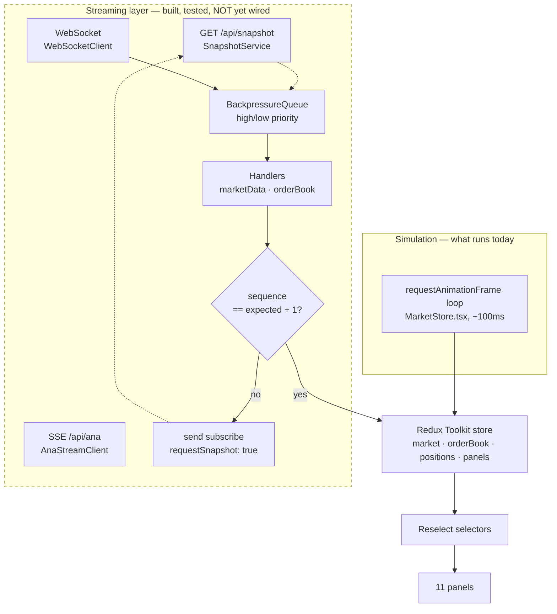

# VANNA Trading Terminal

A multi-panel trading terminal built in React and TypeScript — order book, depth, tape,
candles, positions and watchlist in a draggable, resizable workspace that persists.

<!--
  SCREENSHOT: drop a capture of the running terminal at docs/screenshot.png and
  uncomment the line below. This is the first thing anyone looks at.
  
-->

```
Status   Front-end complete and running on a simulated feed.
         The streaming layer is built and unit-tested but not yet wired to a backend.
Demo     Not deployed yet — see Roadmap.
```

---

## Quick start

Requires Node 22+ and Yarn.

```bash
yarn install
yarn dev          # http://localhost:5173
```

Click the orb, or hit **Enter Terminal**, to get to the dashboard.

```bash
yarn lint         # eslint, including the React Compiler rule set
yarn tsc -b       # typecheck (note: -b — see below)
yarn test:run     # 47 unit tests
yarn build        # tsc -b && vite build
```

With Docker:

```bash
docker compose up --build     # http://localhost:3000
```

---

## Where the data actually comes from

This is the part worth being precise about, because the repo contains two data paths
and only one of them currently runs.



**Today:** `MarketStore.tsx` runs a `requestAnimationFrame` loop that walks prices with a
random step and batch-dispatches into the Redux store roughly every 100ms. Every panel you
see is driven by that.

**Not yet running:** `services/websocket.ts`, `services/snapshotService.ts`,
`services/anaStream.ts` and `workers/indicatorWorker.ts` are written, typed and (for the
buffers) unit-tested, but nothing instantiates them. They are waiting on the backend in
[ROADMAP.md](ROADMAP.md) Tier 2. Until that lands, treat the streaming layer as designed
and reviewed but unproven against a real socket.

---

## Why it is built this way

**Snapshot, then deltas.** An order book cannot be rebuilt from an update stream alone —
you need a known-good starting state. `SnapshotService` fetches the full book over REST
before the socket starts applying deltas, which is how real market data feeds work and why
the two are separate code paths rather than one.

**Sequence validation with re-snapshot on a gap.** Every delta carries a sequence number.
`OrderBookHandler` refuses any delta that is not exactly `expected + 1` and returns `false`
rather than applying it, because a book that has silently missed an update is worse than no
book at all — it looks right and prices wrong. The client responds by requesting a fresh
snapshot for that symbol. Reconnects call `resetAll()` so stale sequence state cannot leak
across a disconnect.

**Backpressure with priority, not a plain buffer.** Under a burst, dropping messages
uniformly would mean dropping order book deltas — the ones that cannot be reconstructed.
`BackpressureQueue` evicts the oldest *low*-priority message to make room, so book and
position updates survive and a market-data tick is what gets sacrificed. If the queue is
all high-priority, the incoming message is dropped instead of silently corrupting the book.

**Exponential backoff.** Reconnects go 1s → 2s → 4s, capped at 30s, so a backend that is
down does not get hammered by every open tab.

**Ingestion split from presentation.** `services/handlers/` owns message decoding and
store dispatch; components only read from selectors. Panels never touch a socket.

**Zod at the boundary.** Anything arriving over SSE is `safeParse`d before it reaches the
store, so a malformed chunk is a logged warning, not a runtime crash mid-render.

---

## Layout

```
src/
  components/panels/   11 panels — order book, depth, tape, chart, positions, ANA, …
  components/ui/       shadcn/ui primitives
  services/            websocket · snapshot · SSE · buffers
  services/handlers/   message decoding → store dispatch
  store/               Redux Toolkit slices, selectors, Context providers
  schemas/             Zod schemas for the API boundary
  workers/             indicator computation (not yet wired)
```

## Stack

| | |
|---|---|
| UI | React 19, TypeScript `strict`, Tailwind, shadcn/ui |
| State | Redux Toolkit + Reselect, Zustand, Context |
| Market data | AG Grid (order book), Lightweight Charts (candles), Recharts |
| Validation | Zod |
| Build | Vite 7, Vitest 3 |
| Deploy | Multi-stage Docker → nginx with SPA fallback |
| CI | Lint · typecheck · test · build, plus Lighthouse CI on PRs |

A note on the typecheck command: the root `tsconfig.json` is `"files": []` plus project
references, so `tsc --noEmit` silently checks **nothing**. Use `tsc -b`. CI got this wrong
until recently and the step was passing vacuously.

---

## Known gaps

Kept here rather than in a commit message, because they are the honest state of the repo.
Full detail and ordering in [ROADMAP.md](ROADMAP.md).

- No backend. The streaming layer has never run against a real socket.
- No order entry or blotter — every panel is read-only.
- `services/websocket.ts` has no tests, despite being the most interesting code here.
- The FPS and render-time figures in the stats footer are hardcoded, not measured.
- Two overlapping UI state layers (`UIContext` and `uiStore`) from an unfinished migration.
