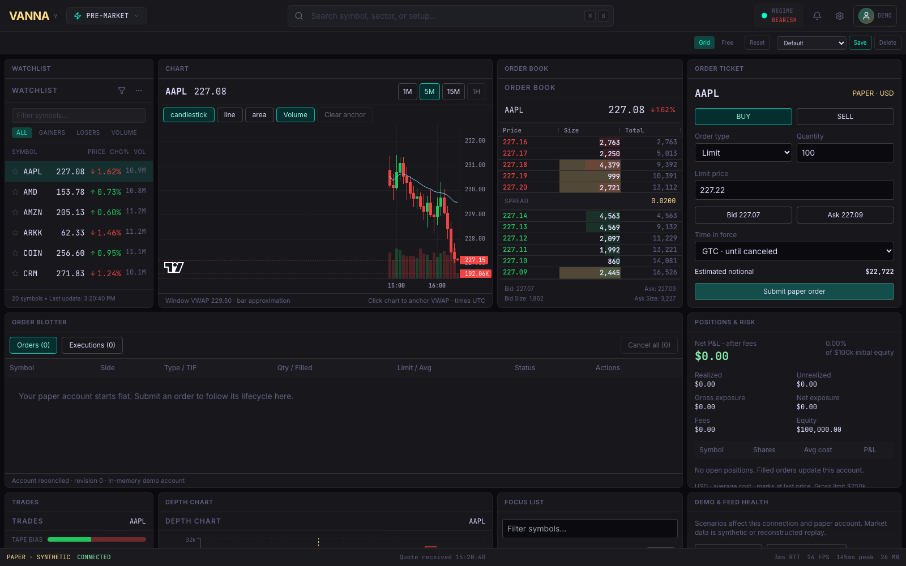
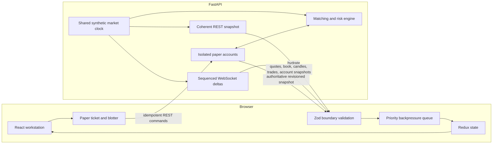

# VANNA Trading Terminal

[](https://github.com/CodingPope/vanna-trading-terminal/actions/workflows/ci.yml)

A front-office style paper-execution workstation built with React, TypeScript, FastAPI,
REST, and WebSockets. It combines a streaming market view with an order ticket, versioned
blotter, executions, positions, risk, and failure-injection controls.



The market is synthetic and every order is a paper order. The application never connects
to a broker or routes real money.

## Run it

The fastest path is Docker Desktop:

```bash
docker compose up --build
```

Open [http://localhost:3000](http://localhost:3000). Stop it with `Ctrl+C`; remove the
containers with `docker compose down`.

For local development, use Node 22+, Yarn 1.22, and Python 3.12. Run the setup once:

```bash
yarn install --frozen-lockfile
python3.12 -m venv server/.venv
server/.venv/bin/pip install -r server/requirements-dev.txt
```

Then start these in separate terminals:

```bash
# Terminal 1 — API, REST snapshots, paper execution, and WebSocket feed
server/.venv/bin/python -m uvicorn app.main:app --app-dir server --reload --port 8000
```

```bash
# Terminal 2 — UI; Vite proxies /api and /ws to port 8000
yarn dev
```

Open [http://localhost:5173/#terminal](http://localhost:5173/#terminal). The UI falls back
to a clearly labelled browser simulation if the API is unavailable; paper order entry is
enabled only when the API account and feed are synchronized.

## A five-minute demo

1. Submit a market paper order for 150 shares. The blotter moves through `working` and
   `partially filled` in 25-share slices; cancel the remainder and inspect fills and P&L.
2. Submit a non-marketable limit order. Amend its price or quantity, then cancel it. The
   server rejects edits made against a stale order version.
3. In **Feed diagnostics**, click **Skip book sequence**. The client detects the gap,
   rejects the unsafe delta, and requests a fresh order-book snapshot.
4. Try **Stall feed 6s**. The terminal marks the feed stale and disables order entry until
   transport health and account synchronization recover.
5. Try **Invalid payload**, **Burst 1,000 quotes**, and **Disconnect feed**. The diagnostics
   distinguish rejected envelopes, display-message shedding, and reconnect recovery.

## System design



The browser hydrates one coherent snapshot before accepting deltas. Order-book messages
carry monotonically increasing sequences; a gap puts the book into recovery until a new
snapshot arrives. All external payloads are parsed with Zod before they reach state.

Paper commands use a per-tab session and immutable `clientOrderId`. Retrying an unknown
acknowledgement returns the original order instead of duplicating it. Amendments use an
order version to prevent lost updates. The server owns order state, fills, fees, average
cost, realized P&L, and exposure checks; the browser renders authoritative account
snapshots.

Market-data bursts enter a bounded priority queue. Disposable quote frames may be shed;
order-book recovery and account snapshots take priority. If the server-side client queue
fills, the server disconnects that client so it can recover from complete snapshots rather
than silently consume a corrupt stream.

Read [Architecture](docs/ARCHITECTURE.md) for invariants and trade-offs, and
[Portfolio guide](docs/PORTFOLIO_GUIDE.md) for the interview story and remaining launch
work.

## Validation

```bash
yarn verify      # lint, 178 frontend tests, server tests, production build
yarn e2e         # 21 Chromium tests against the built UI and real FastAPI service
```

The browser suite covers the order lifecycle, cancellation and amendment, account
isolation, reconnect reconciliation, stale-feed gating, gap recovery, malformed data,
burst behavior, order-book integrity, responsive overflow, and keyboard navigation.

## Stack

| Area | Technology |
|---|---|
| UI | React 19, TypeScript strict mode, Tailwind, shadcn/Radix |
| State | Redux Toolkit, Reselect, Zustand for persisted UI preferences |
| Market UI | AG Grid and Lightweight Charts |
| Boundary contracts | Zod in the browser, Pydantic in FastAPI |
| Transport | REST snapshot plus WebSocket deltas and heartbeats |
| Testing | Vitest, Testing Library, Python `unittest`, Playwright |
| Delivery | Vite production build, nginx reverse proxy, Docker Compose, GitHub Actions |

## Scope

This is a deterministic demonstration environment, not an exchange simulator. Matching is
a documented touch-price model with 25-share slices, a 1% market-order collar, average-cost
positions, $0.005/share fees, a $50,000 per-order cap, and a $250,000 gross-exposure cap.
Accounts live in process memory and expire; there is no authentication, persistence,
exchange calendar, corporate-action model, or real broker connectivity.
