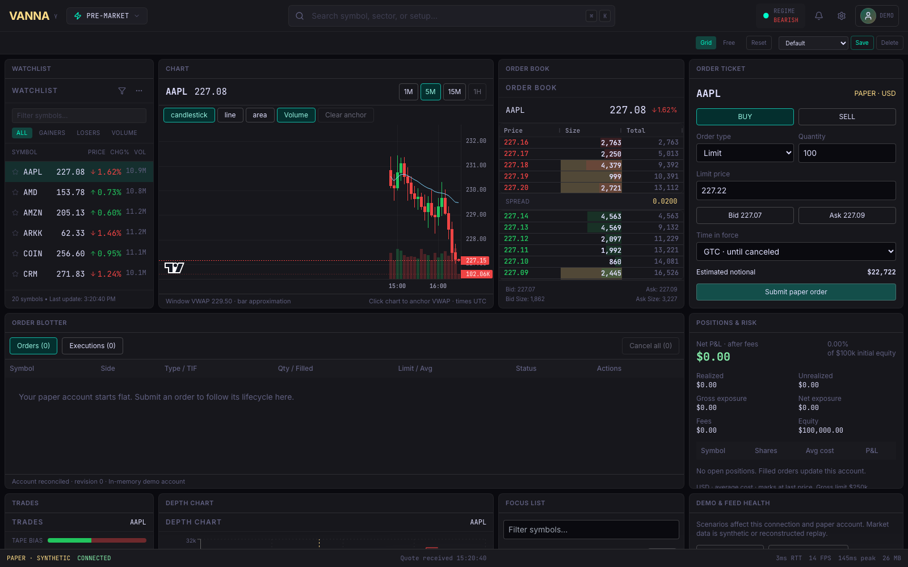

# VANNA Trading Terminal

A front-office paper-execution workstation built with React, TypeScript, FastAPI,
REST, and WebSockets. VANNA combines streaming market views with an order ticket,
versioned blotter, executions, positions, risk, and deterministic failure injection.

> **Current status:** execution, transport, deterministic playback, and measurement run end
> to end. Each browser session owns an isolated replay clock with play, pause, speed, step,
> seek, and reset, and performance claims trace to a reproducible benchmark artifact. Still
> to come: execution against a recorded session, and a hosted demo. Every order is
> simulated; VANNA never connects to a broker or routes real money.

Known bugs and the remaining work are in [ROADMAP.md](ROADMAP.md).

## What works today

- Coherent REST hydration followed by sequenced WebSocket deltas.
- Per-session replay clocks over one shared immutable event store, with play, pause,
  0.5x–5x and max speed, single-unit step, seek, and reset.
- A typed, versioned control protocol: every command is acknowledged exactly once, retry-safe
  by command ID, and answered with authoritative playback state.
- Atomic seek: state is rebuilt from sparse checkpoints and swapped in whole, so a rebuild is
  never observed half-done and its cost is a fixed stride rather than the fixture length.
- Quotes, candles, time and sales, ten-level books, watchlists, and depth views.
- Paper market and limit orders with GTC/IOC, partial fills, cancel, amend, and cancel-all.
- Idempotent submission using immutable client order IDs.
- Version-checked amendments that reject lost-update races.
- Average-cost positions, realized and unrealized P&L, fees, and exposure limits.
- Per-tab paper-account isolation and authoritative reconnect reconciliation.
- Heartbeat and stale-feed detection that gates new order entry.
- Order-book gap detection and snapshot recovery.
- Bounded priority backpressure with observable display-message shedding, and frame folding
  that keeps book recovery out of the shed path under load.
- Frame-level measurement that reports transport jitter, processing latency, frame delay,
  round trip, and replay lag — and refuses to report one-way latency, which needs clocks
  this system does not have.
- Connection-scoped scenarios for gaps, stalls, malformed payloads, bursts, and disconnects.
- A production build, Docker Compose stack, CI, and real-stack browser tests.

## Data provenance

The data source must always be obvious from the interface. VANNA currently uses these
classifications:

| Label | Meaning | Current availability |
|---|---|---|
| **SYNTHETIC** | Seeded prices, trades, candles, and depth generated by the server | Default |
| **REPLAY** | Recorded bar anchors with reconstructed intrabar movement and synthetic depth | Engine support exists; no fixture ships |
| **RECORDED** | Historical trade and book events replayed in original event order | Engine, controls, and seek are complete; no licensed fixture ships |

The event importer writes validated, checksummed fixtures, and the runtime replays them
through the event store when one is configured; without one it falls back to the seeded
synthetic engine and says so. The mode is shown in the interface and carried on every
playback status frame. The target release adds a licensed historical event fixture with a
manifest containing provider, venue, dataset, schema, date, symbols, checksum, and
redistribution status. Recorded, derived, reconstructed, and simulated fields remain
explicitly distinguished.

The recommended source is a small licensed slice of Nasdaq TotalView historical data through
Databento: three symbols, three short market regimes, and top-ten market-by-price events.
No vendor API key will be committed or required by someone visiting the finished demo.
See [docs/DATA_LICENSE.md](docs/DATA_LICENSE.md) for the license review.

## Run it

The fastest local path is Docker Desktop:

~~~bash
docker compose up --build
~~~

Open [http://localhost:3000](http://localhost:3000). Stop the stack with **Ctrl+C**
and remove its containers with **docker compose down**.

For local development, use Node 22+, Yarn 1.22, and Python 3.12. Run once:

~~~bash
yarn install --frozen-lockfile
python3.12 -m venv server/.venv
server/.venv/bin/pip install -r server/requirements-dev.txt
~~~

Start the API:

~~~bash
server/.venv/bin/python -m uvicorn app.main:app --app-dir server --reload --port 8000
~~~

In a second terminal, start the UI:

~~~bash
yarn dev
~~~

Open [http://localhost:5173/#terminal](http://localhost:5173/#terminal). Vite proxies
**/api** and **/ws** to the service on port 8000. If that service is unavailable, the
UI falls back to a clearly labelled local simulation and disables paper execution.

## Deploy

The UI is static and runs on Vercel; the API is a single long-lived process and runs on
Fly.io. REST calls go through a Vercel rewrite to the API, so they stay same-origin. Vercel
cannot proxy a WebSocket, so the browser opens the socket on Fly directly.

1. **API.** From `server/`, run `fly launch --no-deploy` (keep the existing `fly.toml`), set
   `VANNA_ORIGIN` in it to your Vercel domain, then run `fly deploy --ha=false`. Keep one
   machine: sessions live in memory.
2. **UI.** Import the repository in Vercel. If the Fly app is not named `vanna-api`, change
   the rewrite in `vercel.json`. Set the environment variable
   `VITE_WS_URL=wss://<your-fly-app>.fly.dev/ws`, then deploy.

`server/.dockerignore` keeps `server/fixtures/private/` out of the image; licensed recorded
data is never deployed.

## Current five-minute demo

1. Submit a 150-share market paper order. Watch it become partially filled, cancel the
   remainder, and inspect executions, fees, position, and P&L.
2. Submit a non-marketable limit order. Amend its price or quantity, then cancel it.
3. Click **Skip book sequence**. The client rejects the unsafe delta and requests a new
   authoritative book snapshot.
4. Click **Stall feed 6s**. The terminal marks the feed stale and disables order entry
   until transport health and account synchronization recover.
5. Try **Invalid payload**, **Burst 1,000 quotes**, and **Disconnect feed**. Diagnostics
   separate rejected envelopes, display-data shedding, and reconnect recovery.
6. Use the replay bar: pause the clock with **P**, step one unit with **.**, change speed,
   and reset. Open a second tab — its session replays independently. Disconnect the feed and
   watch the controls come back from the server rather than from client memory.

The target demo adds a licensed recorded session with selectable regimes, deterministic fill
outcomes at event time, and a repeatable high-rate benchmark.

## Architecture

~~~mermaid
flowchart LR
  subgraph Browser
    UI[React workstation]
    Z[Zod boundary validation]
    Q[Priority backpressure queue]
    R[Redux state]
    T[Paper ticket and blotter]
    Z --> Q --> R --> UI
    UI --> T
  end

  subgraph FastAPI
    S[Coherent REST snapshot]
    W[Sequenced WebSocket deltas]
    M[Market clock]
    P[Isolated paper accounts]
    E[Matching and risk]
    M --> S
    M --> W
    M --> E
    P <--> E
  end

  S -->|hydrate| Z
  W -->|market and account events| Z
  T -->|idempotent REST commands| P
  P -->|revisioned account snapshot| Z
~~~

The browser hydrates a coherent snapshot before it accepts deltas. Each book message
carries a monotonically increasing sequence. A missing sequence puts that symbol into
recovery until a fresh snapshot arrives. Zod parses every incoming envelope before state
mutation.

The server owns order state, fills, cash, positions, fees, P&L, and risk. Retrying an
unknown acknowledgement reuses the original client order ID instead of creating a second
order. Amendments include the last observed order version.

Under load, disposable display quotes may be shed. Book recovery and paper-account
snapshots receive priority. A saturated server connection is closed so the client can
recover from complete state rather than silently consume a corrupt stream.

Read [Architecture](docs/ARCHITECTURE.md) for current invariants and trade-offs,
[Replay protocol](docs/PROTOCOL.md) for the playback control contract,
[Measurement protocol](docs/PERFORMANCE.md) for what the latency numbers mean, and
[Roadmap](ROADMAP.md) for known bugs and what comes next.

## Measured

~~~bash
yarn benchmark   # fixed scenario, twice, against the production build
~~~

On the reference machine (Apple M1, 8 cores; Chromium 151; production build behind
`vite preview`; loopback; synthetic source), a 30-second window at 5x after a 5-second
warmup sustains **~400 feed envelopes per second with zero lost frames, zero book gaps, and
zero shed display quotes**, at a transport-jitter p99 under 1.5ms. Two back-to-back runs
agree within 1%.

Pushed to `max` speed — about 1,300 envelopes per second — the queue saturates and book
deltas start being dropped, each drop costing a snapshot recovery. Folding frames that make
each other redundant (a newer book snapshot replaces an older one; print batches for one
symbol concatenate; deltas are never folded, because they are cumulative) took that from
**20 recovery round trips to 0**, at a cost of about 3ms on receive-to-commit p95. Other
candidates — chart batching, virtualization, workers — were measured and deferred: at the
reference rate there is nothing for them to fix.

Every figure comes from [docs/benchmarks/](docs/benchmarks/), and the report is rendered from
the artifact rather than written by hand. VANNA does not report one-way latency at all: the
server and browser clocks are not synchronised, so it cannot be measured here.
[docs/PERFORMANCE.md](docs/PERFORMANCE.md) has the method and the list of things deliberately
not claimed.

## Validation

~~~bash
yarn verify      # lint, frontend/server tests, production build, bundle budgets
yarn e2e         # 27 Chromium tests against the built UI and real FastAPI service
yarn benchmark   # feed benchmark and its artifact
yarn budget      # bundle budgets against the last build's analysis
~~~

A first visit downloads **~108 kB of gzipped JavaScript**. The four heavy dependencies —
three.js, AG Grid, Recharts, Lightweight Charts — each sit behind the dynamic import for the
panel or page that uses them, and a browser test loads the app cache-cold on a throttled
connection to prove the first route does not wait for any of them. `yarn budget` enforces the
limits in [bundle-budget.json](bundle-budget.json) and names the offending asset, and its
modules, when one is exceeded.

The browser suite covers the paper-order lifecycle, cancel and amend, account isolation,
reconnect reconciliation, stale-feed gating, sequence recovery, malformed data, bursts,
book integrity, responsive overflow, keyboard navigation, replay transport controls, and
two-session playback independence.

## Stack

| Area | Technology |
|---|---|
| UI | React 19, TypeScript strict mode, Tailwind |
| State | Redux Toolkit, Reselect, Zustand for persisted UI preferences |
| Market UI | AG Grid and Lightweight Charts |
| Contracts | Zod in the browser, Pydantic in FastAPI |
| Transport | REST snapshot plus WebSocket deltas and heartbeats |
| Testing | Vitest, Testing Library, Python unittest, Playwright |
| Delivery | Vite, nginx, Docker Compose, GitHub Actions |

## Scope and limits

The current matcher fills at the synthetic touch in 25-share slices, applies a 1% market
collar, uses average-cost accounting, charges $0.005/share, caps individual orders at
$50,000, and caps gross exposure including working orders at $250,000.

Paper matching still runs at the synthetic touch on the session clock. Moving execution onto
recorded event time, so fills sweep real visible depth, is the next milestone and needs a
licensed fixture first.

It does not claim exchange queue position, venue routing, price improvement, durable
custody, market-data entitlement management, or exchange-grade execution. Accounts and
replay sessions are ephemeral and live in one server process. Authentication, a durable audit
log, real broker connectivity, and multi-worker state distribution are outside the
recorded-replay release.
